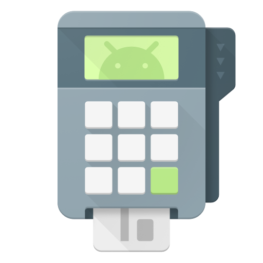

 
# Cashier [](https://travis-ci.com/KeepSafe/Cashier)

A general billing provider for Android. Supports Google Play's in-app billing v3 and Amazon's in-app billing out of the box.

**Min SDK:** 9

## Overview

Managing multiple billing services in your Android app is a painful experience when each billing service has their own way of doing things. Google's In-App billing service, for example, requires IPC calls to the Google Play app on users' phones; while others, such as Amazon's in-app billing service requires network calls, services, and listeners.

Cashier takes aim to resolve these issues by providing a single consistent API design with differing underlying implementations so that you can write your billing code once, and easily swap billing providers.

## Installation

## Usage

We currently bundle implementations for Google Play's in-app billing API v3 and Amazon's in-app billing API.

[See specific usage for Google Play](#soon) or [See specific usage for Amazon](#soon)

In general, usage is as follows:
```

TBD Code

```

## Sample App

For a buildable / workable sample app, please see the `sample` project under `sample/`.

## License

    Copyright 2016 KeepSafe Inc.

    Licensed under the Apache License, Version 2.0 (the "License");
    you may not use this file except in compliance with the License.
    You may obtain a copy of the License at

       http://www.apache.org/licenses/LICENSE-2.0

    Unless required by applicable law or agreed to in writing, software
    distributed under the License is distributed on an "AS IS" BASIS,
    WITHOUT WARRANTIES OR CONDITIONS OF ANY KIND, either express or implied.
    See the License for the specific language governing permissions and
    limitations under the License.
